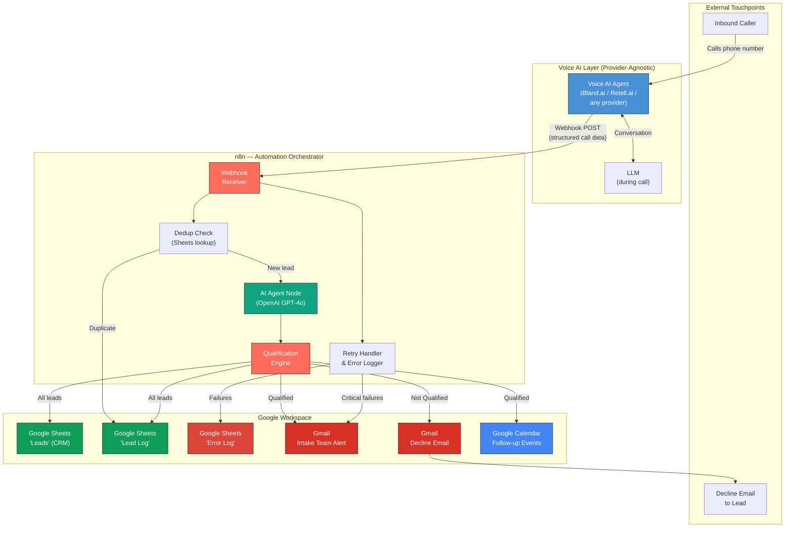
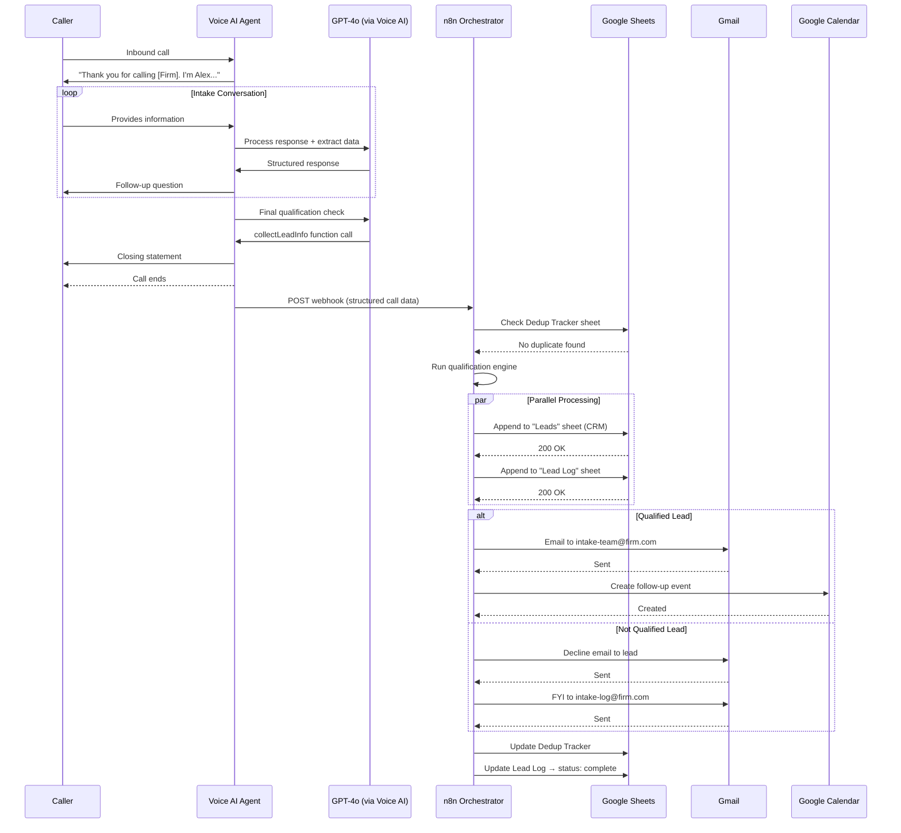
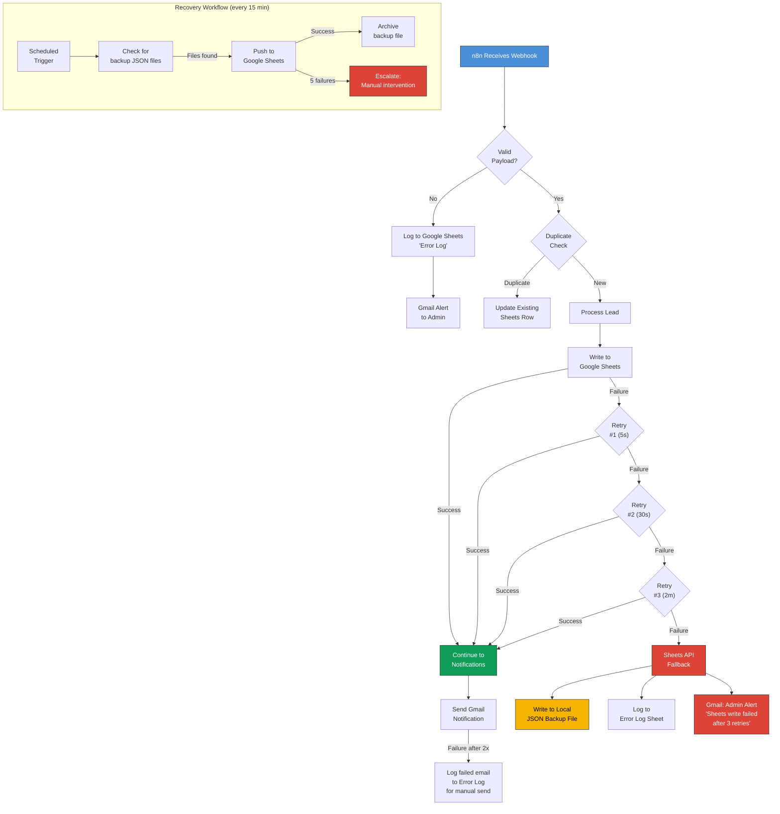
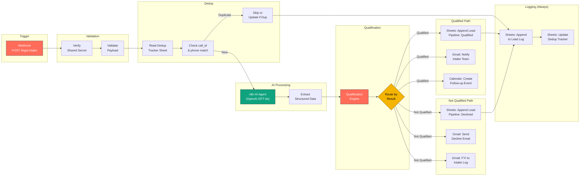
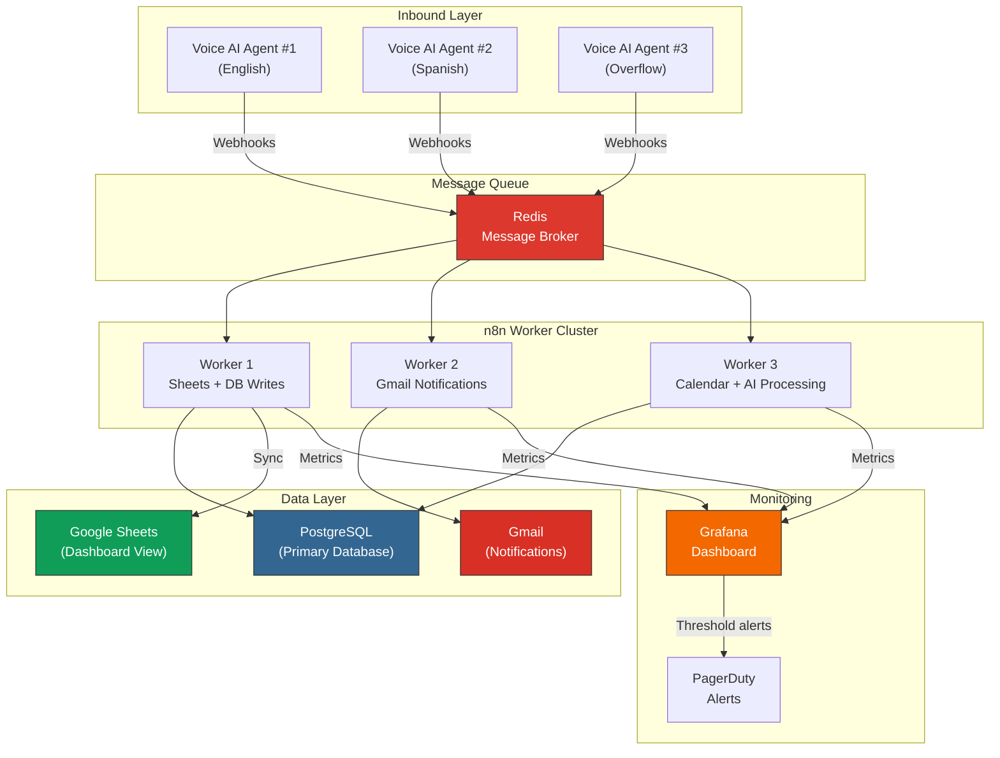

# System Architecture Diagrams

Render these Mermaid diagrams at https://mermaid.live or in any Markdown editor that supports Mermaid.

---

## Diagram 1: High-Level System Architecture

---

## Diagram 2: Call Flow Sequence

---

## Diagram 3: Error Handling Flow

---

## Diagram 4: n8n Workflow Overview

---

## Diagram 5: Scaling Architecture (10x Volume)

